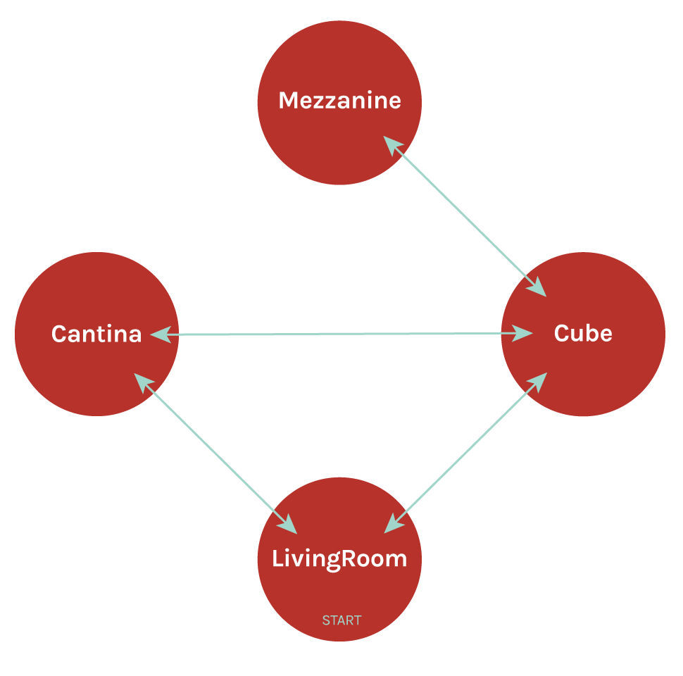
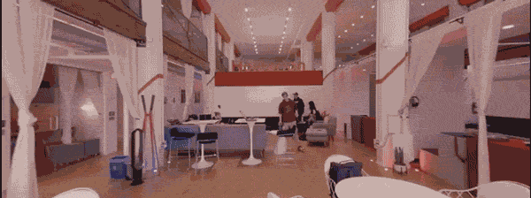

# 0x0A-unity-360_video_tour
A video tour set in Holberton School San Francesco campus for Google Cardboard with interactable hotspots and textboxes.  
This is my first VR unity project. I tried developing it with both the Oculus Quest headset and the Google Cardboard, but it worked best with the Google Cardboard because I ran into many bugs and problems with the Quest headset.  
 
 
 

# Attributions
* "[Tech Live](https://incompetech.filmmusic.io/song/4463-tech-live/)" by Kevin MacLeod
# Links
* [Linkdin](https://www.linkedin.com/in/aziz-ayed-20a462192/)
* [Twitter](https://twitter.com/frank2point4ghz)